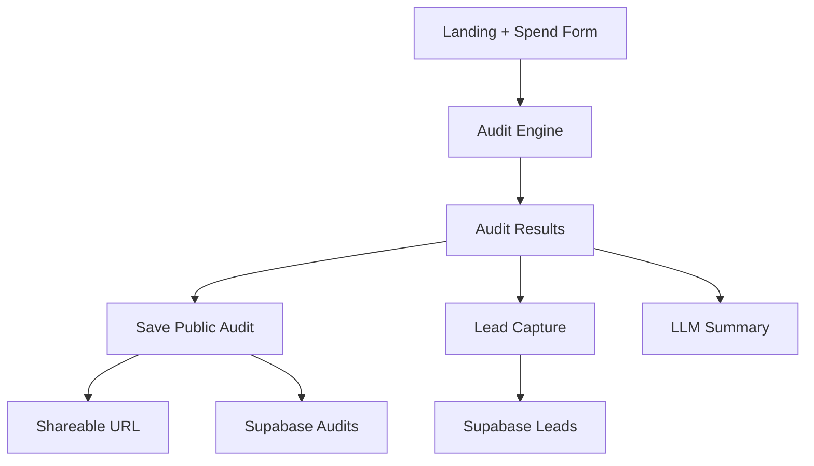

# Architecture

## Data flow
1. User enters tools, plans, monthly spend, seats, and primary use case.
2. Client runs the audit engine to compute baseline spend and recommendations.
3. Results are shown immediately (no email gate).
4. A public-safe audit snapshot is stored and returned as a shareable URL.
5. Optional lead capture stores contact info and sends a confirmation email.
6. LLM summary is generated on demand and falls back to a template on errors.

## Why this stack
- Next.js App Router for server actions, shareable routes, and SEO metadata.
- TypeScript + Zod for validated inputs.
- Supabase for durable lead storage and public audit snapshots.
- Resend for transactional email.

## Scaling to 10k audits/day
- Move audit writes to a queue for burst protection.
- Cache pricing data and summary prompts at the edge.
- Use rate limiting with Redis or Supabase Edge Functions.
- Store per-audit summaries in a separate table for faster share URL reads.
