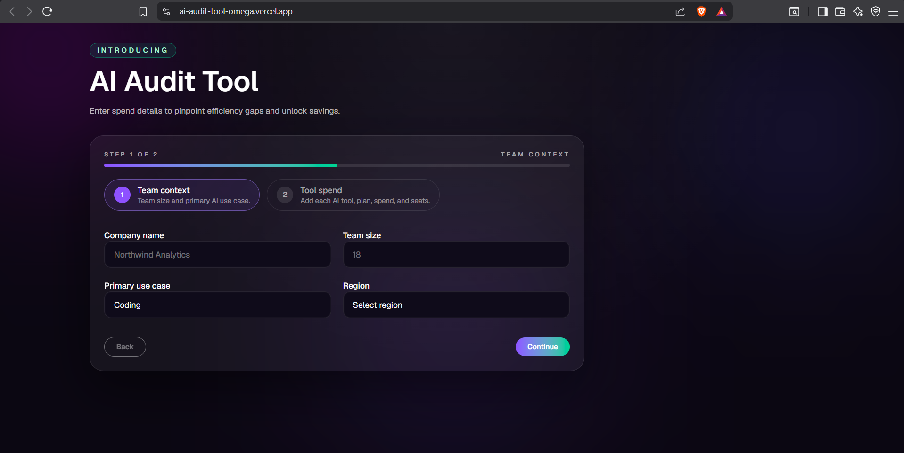
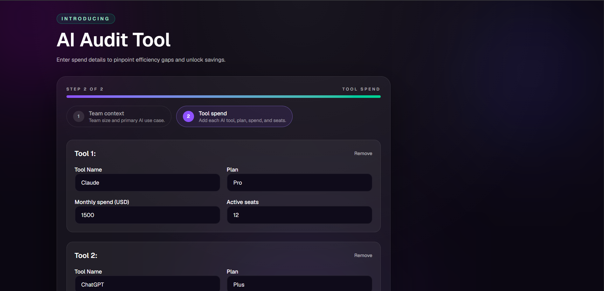
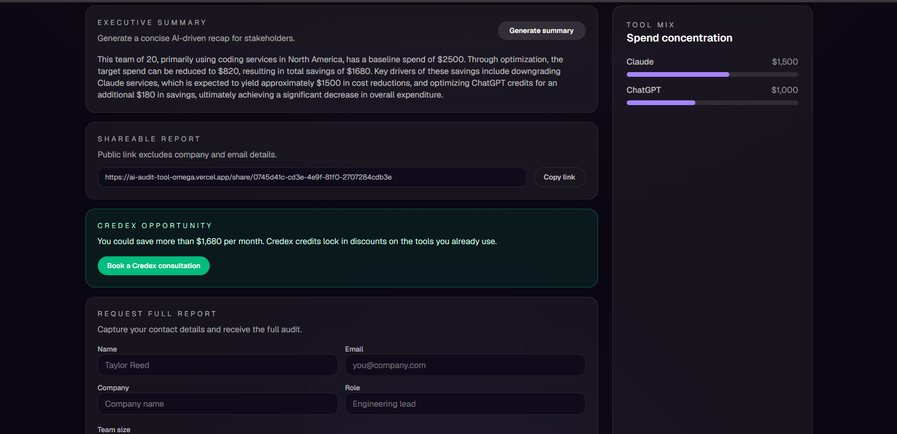

# Credex AI Spend Audit

A free AI spend audit tool for startup teams to benchmark tool spend, identify plan downgrades, and surface potential credit savings. It generates a shareable audit summary and captures leads after value is shown.

## Features
- Spend input form with tool, plan, spend, seats, team size, and primary use case.
- Deterministic audit engine with savings math and defensible reasoning.
- Results page with monthly + annual savings and a shareable public URL.
- AI-generated executive summary with fallback logic.
- Lead capture with Supabase storage and transactional email delivery.

## Screenshots
- Audit Input Form: 
- Results: 
- Sharable Report: 
- Mail: 

## Quick start
```bash
npm install
npm run dev
```

## Tests
```bash
npm test
```

## Environment variables
Set these in your local `.env` and in Vercel:
- SUPABASE_URL
- SUPABASE_SERVICE_ROLE_KEY
- RESEND_API_KEY
- RESEND_FROM_EMAIL
- APP_BASE_URL
- AUDIT_REPORT_DOWNLOAD_BASE_URL (optional)
- ANTHROPIC_API_KEY (optional)
- GROQ_API_KEY (optional)

## Deployment (Vercel)
1. Push the repo to GitHub.
2. Create a new Vercel project and import the repo.
3. Add the environment variables listed above.
4. Set `APP_BASE_URL` to your production domain so share links and emails point to the live site.
5. Deploy.

Deployed URL: https://ai-audit-tool-omega.vercel.app/

## AI usage disclosure
I used Claude Sonnet 4.6 primarily for brainstorming workflow planning, architecture discussions, optimization strategies for the audit engine, and refining the recommendation logic for AI tool comparisons. It helped me think through the business reasoning behind identifying overspending patterns, pricing optimization opportunities, and building explainable audit recommendations.

For development and implementation tasks, I used GPT-5.2 Codex to assist with frontend component generation, React and Next.js development, backend API scaffolding, TypeScript type generation, utility function creation, and debugging repetitive implementation issues. It also helped accelerate development speed while working across multiple files and integrations.

However, I did not rely entirely on AI-generated outputs. All pricing information, audit calculations, recommendation rules, and financial reasoning were manually verified and implemented. I specifically avoided trusting AI for financial optimization logic because inaccurate recommendations could reduce the credibility of the tool. I treated AI tools as productivity assistants rather than autonomous developers.

One important example where AI was wrong occurred during recommendation generation. An AI-generated suggestion incorrectly recommended enterprise-level plans for smaller teams without considering actual pricing efficiency. I manually reviewed and rejected those outputs, which reinforced my decision to build a deterministic rule-based audit engine instead of relying on generative AI for financial recommendations.

## Decisions (trade-offs)
1. Tool pricing is modeled as plan-level seats and usage, not token-level usage, to keep the input form simple.
2. Audit recommendations choose a single top action per tool to avoid overwhelming users in the first pass.
3. Shareable audits store only public-safe data (no email/company), trading off rich personalization for safety.
4. Lead capture email is sent after persistence, so a temporary email outage does not block form submission.
5. A lightweight honeypot + email cooldown is used instead of heavier CAPTCHA to reduce friction.
